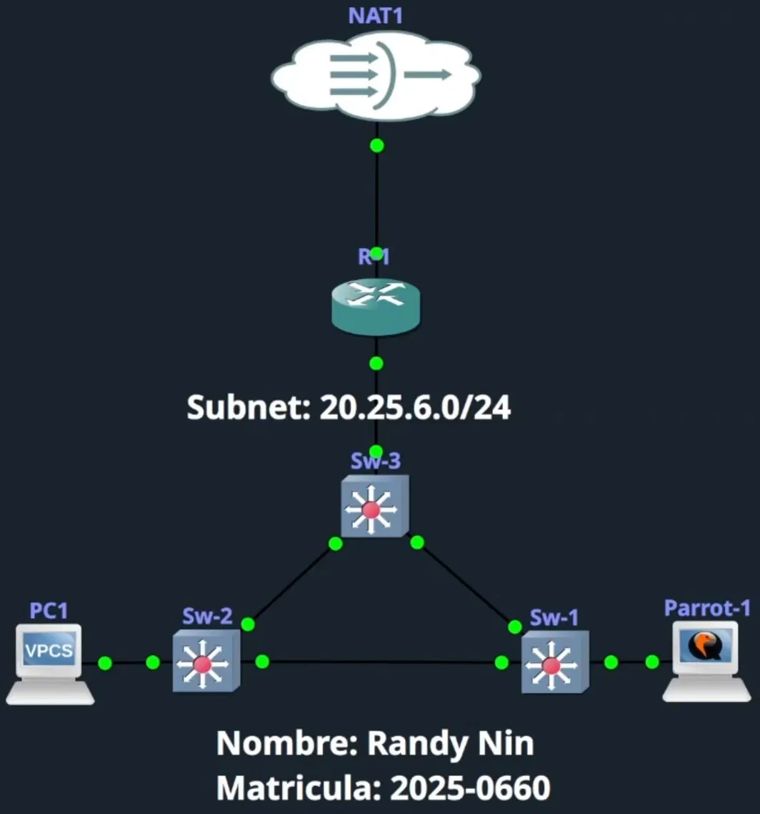

# STP-CLAIM-ROOT

> **Autor:** Randy Nin | **Matrícula:** 2025-0660 **Laboratorio de Seguridad de Redes | GNS3**

Script de Python que usurpa el rol de Root Bridge en un dominio STP enviando BPDUs de configuración IEEE 802.1D con un Bridge ID artificialmente inferior al de cualquier switch real de la red. Al recibir estos BPDUs, todos los switches del dominio los aceptan como superiores, actualizan su Root ID y reconvergen la topología hacia el atacante, desplazando al Root Bridge legítimo y desencadenando interrupciones en el tráfico durante cada reconfiguración.

---

## Contenido del repositorio

```
STP-CLAIM-ROOT/
├── stp_claim_root.py
├── Documentación Tecnica Profesional STP CLAIM ROOT (Randy Nin -- 2025-0660).pdf
└── README.md
```

---

## Documentación técnica

La documentación técnica completa de este laboratorio está disponible en:

**[Documentación Tecnica Profesional STP CLAIM ROOT (Randy Nin -- 2025-0660).pdf](Documentación%20Tecnica%20Profesional%20STP%20CLAIM%20ROOT%20(Randy%20Nin%20--%202025-0660).pdf)**

Incluye contexto técnico del protocolo STP y su vulnerabilidad, topología y estado inicial del dominio STP, análisis completo del script y estructura del BPDU, evidencia de la usurpación del Root Bridge con capturas, comportamiento de recuperación al detener el ataque y contramedidas con PortFast y BPDU Guard.

---

## Requisitos

**Sistema:** ParrotSec OS, Kali Linux o cualquier distribución Linux con soporte para envío de tramas raw a nivel de Capa 2.

**Python:** 3.x con permisos de superusuario (`sudo`).

**Dependencias externas:**

|Librería|Instalación|
|:--|:--|
|`scapy`|`pip install scapy`|
|`termcolor`|`pip install termcolor`|
|`pwntools`|`pip install pwntools`|

**Instalación rápida:**

```bash
pip install scapy termcolor pwntools
```

---

## Uso

```bash
sudo python3 stp_claim_root.py -i <interfaz> [opciones]
```

**Parámetros:**

|Flag|Requerido|Default|Descripción|
|:--|:-:|:-:|:--|
|`-i` / `--interface`|Sí|N/A|Interfaz desde la que se envían los BPDUs falsificados|
|`-p` / `--priority`|No|`4096`|Prioridad anunciada en el Bridge ID falso (debe ser inferior a la de los switches reales)|
|`-m` / `--mac`|No|Aleatoria|MAC fija para la identidad del root falso. Si se omite, se genera una aleatoria `02:xx:xx:xx:xx:xx`|
|`-t` / `--interval`|No|`1.0`|Segundos entre cada BPDU enviado|

**Ejemplo usado en el laboratorio:**

```bash
sudo python3 stp_claim_root.py -i ens4
```

Presionar `Ctrl+C` para detener el ataque. El script imprime el total de BPDUs enviados al finalizar.

---

## Cómo funciona

Al iniciarse, el script obtiene la MAC real de la interfaz, genera una MAC aleatoria como identidad del root falso y construye un BPDU de configuración IEEE 802.1D que reutiliza en cada iteración:

```
Dot3 (dst=01:80:c2:00:00:00, src=MAC_real_atacante)
  └── LLC (dsap=0x42, ssap=0x42, ctrl=0x03)
        └── STP Configuration BPDU
              ├── rootid    : 4096 (menor que prioridad de switches reales)
              ├── rootmac   : 02:xx:xx:xx:xx:xx (MAC aleatoria)
              ├── pathcost  : 0 (el anunciante ES el root)
              ├── bridgeid  : 4096
              └── bridgemac : misma MAC aleatoria
```

Al recibir un BPDU con Bridge ID (4096 + 02:xx:xx:xx:xx:xx), numéricamente inferior al del Root Bridge legítimo (32769 + MAC del switch), todos los switches lo aceptan como superior y reconvergen la topología hacia el atacante. Al detener el script, los switches esperan el MaxAge (20s) sin recibir BPDUs del root falso y reestablecen la elección legítima.

---

## Entorno de laboratorio




|Dispositivo|Rol|Bridge ID / IP|
|:--|:--|:--|
|Sw-1|Root Bridge inicial|Prioridad 32769 / MAC 0ca5.af30.0000|
|Sw-2|Switch no-root|Prioridad 32769 / MAC 0ce3.4806.0000|
|Sw-3|Switch no-root|Prioridad 32769 / MAC 0cad.fafa.0000|
|Parrot-1|Atacante|20.25.6.64/24 / MAC 0c:db:b8:ad:00:00|
|PC1|Host legítimo|20.25.6.61/24 (DHCP)|
|R-1|Gateway / DHCP / NAT|20.25.6.60/24|

> El ataque opera exclusivamente en Capa 2. La configuración IP no tiene relación directa con el mecanismo STP.

---

## Impacto observado

- Todos los switches del dominio aceptan al atacante como Root Bridge al recibir el primer BPDU con prioridad 4096
- Sw-1 pierde el rol de Root Bridge y configura Gi0/0 (puerto hacia Parrot-1) como su Root Port
- La topología STP reconverge completamente hacia el atacante
- Interrupciones en el tráfico durante cada ciclo de reconfiguración
- Al detener el script, la topología se recupera automáticamente tras expirar el MaxAge

---

## Mitigación

PortFast + BPDU Guard en el puerto de acceso del atacante:

```
Switch(config)# interface GigabitEthernet0/0
Switch(config-if)# switchport mode access
Switch(config-if)# spanning-tree portfast
Switch(config-if)# spanning-tree bpduguard enable
Switch(config-if)# exit
```

Con BPDU Guard activo, el primer BPDU recibido por el puerto coloca la interfaz en `err-disable` de forma inmediata y automática, antes de que el ataque pueda afectar la elección del Root Bridge. El switch registra el evento en el log del sistema.

**Recuperación manual del puerto err-disable:**

```
Switch(config)# interface GigabitEthernet0/0
Switch(config-if)# shutdown
Switch(config-if)# no shutdown
```

**Recuperación automática (producción):**

```
Switch(config)# errdisable recovery cause bpduguard
Switch(config)# errdisable recovery interval 300
```

---

## Video demostrativo

**Enlace:** [https://youtu.be/iSo_wrsECSg](https://youtu.be/iSo_wrsECSg)

---

## Disclaimer

Este script fue desarrollado con fines exclusivamente académicos y educativos. Su uso está permitido únicamente en entornos propios o autorizados como GNS3, EVE-NG o laboratorios internos de prueba. El uso en redes de producción o de terceros sin autorización expresa constituye una violación legal.

---

_Randy Nin / Matrícula 2025-0660_

---
